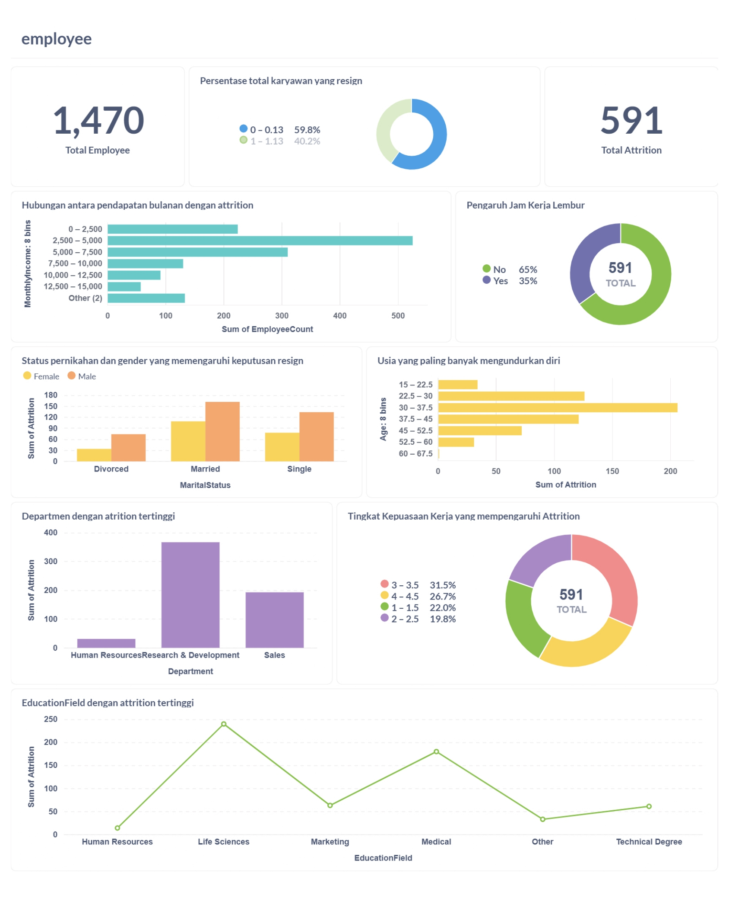

# Employee Attrition Prediction Analytics Dashboard

## Business Understanding

Jaya Jaya Maju merupakan salah satu perusahaan multinasional yang bergerak di bidang edutech dan telah berdiri sejak tahun 2000. Perusahaan ini memiliki lebih dari 1.000 karyawan yang tersebar di seluruh wilayah Indonesia. Walaupun telah berkembang pesat, perusahaan menghadapi tantangan serius dalam pengelolaan sumber daya manusia, terutama terkait tingginya attrition rate (tingkat keluar masuk karyawan) yang melebihi 10%.

Untuk menjaga kestabilan dan keberlanjutan operasional, manajemen HR ingin menganalisis lebih dalam faktor-faktor yang berkontribusi terhadap attrition rate ini serta membangun business dashboard untuk memonitor metrik penting terkait SDM.

### Permasalahan Bisnis

1. Attrition rate karyawan yang tinggi (>10%)
2. Kurangnya pemahaman mendalam mengenai faktor-faktor penyebab karyawan keluar
3. Tidak adanya sistem dashboard yang memantau kondisi dan indikator HR secara berkala
4. Kurangnya data-driven decision-making dalam pengambilan kebijakan HR

### Cakupan Proyek

Proyek ini akan mencakup:
- Eksplorasi dan analisis dataset karyawan yang disediakan oleh perusahaan.
- Identifikasi faktor-faktor utama yang memengaruhi attrition, seperti:

1. MonthlyIncome (Gaji)
2. OverTime (Jam kerja lembur)
3. MarialSatus dan Gender (Status Pernikahan dan Gender)
4. Age (Usia)
5. JobSatisfaction (Tingkat Kepuasan kerja)
6. Departmen (Department dengan attrition tertinggi)
7. EducationField (Bidang pendidikan setiap karyawan)

- Membuat model machine learning dengan algoritma KNN dan SVM

### Persiapan

Sumber data: employee_data.csv

Setup environment:
1. Menginstall docker
2. Menjalankan perintah docker pull metabase/metabase:v0.46.4
3. Menjalankan image docker dengn perintah docker run -p 3000:3000 --name metabase metabase/metabase
4. Untuk masuk ke metabase, menggunakan URL berikut: http://localhost:3000/setup. 
5. Menginstal beberapa library Python yang dibutuhkan yaitu dengan pip install pandas sqlalchemy
6. Menggunakan PostgreSQL sebagai DBMS yang dijalankan pada sebuah layanan cloud bernama supabase
7. Integrasi dengan Metabase
8. Membuat dashboard
9. Membuat model machine learning dengan Algoritma KNN dan SVM
 - Untuk KNN yaitu:
    - from sklearn.neighbors import KNeighborsClassifier
    - knn = KNeighborsClassifier(n_neighbors=3)
 - Untuk SVM yaitu:
    - from sklearn.svm import SVC
10. Gunakan perintah  !pip freeze requirements.txt untuk menyimpan semua library python

## Business Dashboard

Dashboard yang telah dibuat berisi visualisasi untuk menjawab pertanyaan berikut:

1. Apakah karyawan yang sering lembur cenderung keluar?
2. Apkah karyawan dengan gaji bulanan yang rendah rentan keluar?
3. Apakah status pernikahan dan gender berpengaruh terhadap keputusan keluar?
4. Bagaimana korelasi antara tingkat kepuasan kerja dan attrition?
5. Rentang usia berapa yang paling rentan terhadap attrition?
6. Apakah ada perbedaan tingkat attrition berdasarkan bidang pendidikan?
7. Apakah departmen dari karyawan bekerja berpengaruh terhadap attrition?

## Conclusion

Melalui analisis data dan visualisasi yang telah dibuat, ditemukan bahwa faktor paling signifikan yang memengaruhi tingginya attrition adalah:

1. Karyawan yang sering lembur memiliki kemungkinan lebih tinggi untuk keluar.
2. Karyawan dengan pendapatan rendah cenderung lebih mudah meninggalkan perusahaan.
3. Kepuasan terhadap manajer dan lingkungan kerja memainkan peran penting.
4. Departmen Research and Development memiliki tingkat attrition yang tinggi.
5. Usia 30-37.5 memiliki tingkat attrition yang tinggi
6. Jenis kelamin Laki=laki dan status Married memiliki tingkat attrition yang tinggi
7. EducationField 'LifeSciense' memiliki tingkat attrition tertinggi

Melalui model machine learning yang telah dibuat:
1. Model KNN dengan dengan K = 3 mendapatkan akurasi 57%
2. Model SVM dengan kernel rbf mendapatkan akurasi 61%
3. Model SVM dengan kernel linear mendapatkan akurasi 59%
4. Model SVM dengan kernel poly mendapatkan akurasi 58%
Dapat dilihat bahwa model SVM dengan kernel rbf memiliki tingkat akurasi yang paling tinggi diantara 2 algoritma tersebut.

### Rekomendasi Action Items (Optional)

Berikan beberapa rekomendasi action items yang harus dilakukan perusahaan guna menyelesaikan permasalahan atau mencapai target mereka.

- Lakukan survei kepuasan kerja secara berkala untuk mendeteksi ketidakpuasan sejak dini
- Kurangi beban lembur bagi karyawan, terutama di departemen yang mengalami attrition tinggi
- Tinjau kembali struktur gaji, khususnya untuk level staf dengan pendapatan terendah
